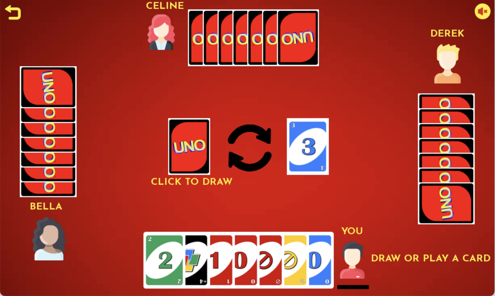

# UNO
1. Desktop app of popular card game UNO
2. 3 bots play against the user. The bots use greedy algorithm to make moves
3. The game has two modes: Easy and Difficult

## How to play
You can check [rule of the game](https://en.wikipedia.org/wiki/Uno_(card_game)#Official_rules) for more information.
```
git clone https://github.com/godmoves/pyUNO
cd uno_game
python driver.py
```

## Screenshots



